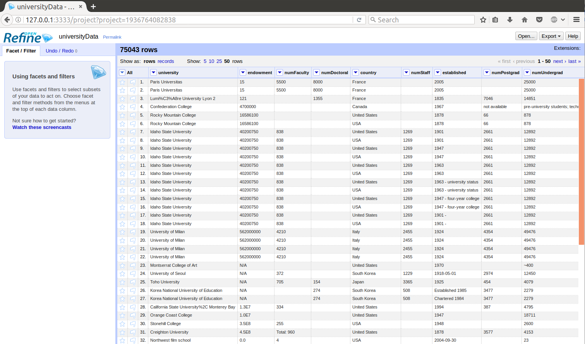
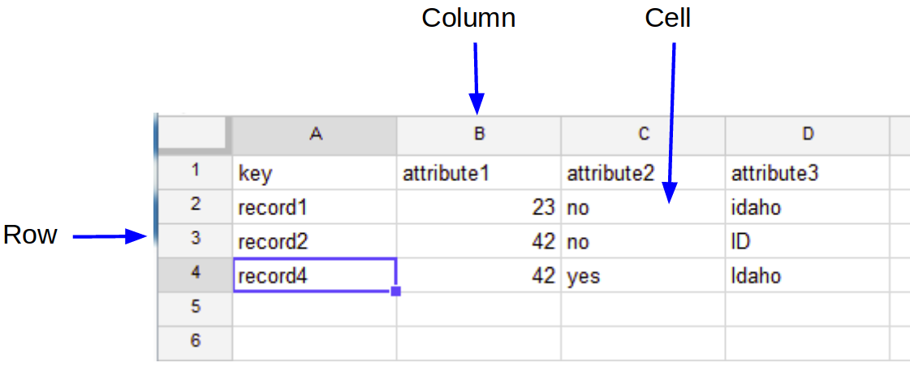

# What is OpenRefine?

OpenRefine is a [free](https://www.gnu.org/philosophy/free-sw.en.html), [open source](https://github.com/OpenRefine/OpenRefine), Java application, that runs offline in a web browser.

**You can use OpenRefine to:**

* Get and overview of a data set
* Split complex data fields into more granular parts
* Clean up tabular data by removing inconsistencies in format and terminology
* Enhance a data set with data from other sources

## Tabular Data

Refine can handle all sorts of data!

- Import formats: TSV, CSV, custom separator txt, Excel, XML, JSON, Google Spreadsheets, RDF
- Sources: local file, archive (zip), URL, clipboard, or Google

Comfortable performance up to 100,000's of rows.

## Use Cases

**Clean** - discover and fix inconsistency with faceting, clustering, cell transforms, GREL expressions...

**Transform** - change formats or reshape with split/join multi valued cells, split columns, transpose columns/rows...

**Extend** - enrich data by combining files, merging projects, fetching URLs, reconciliation with online databases...

**Automate** - reuse your processing routine by exporting operation history in JSON!
